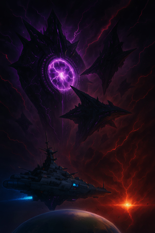
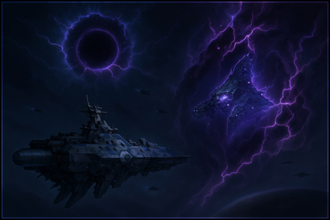
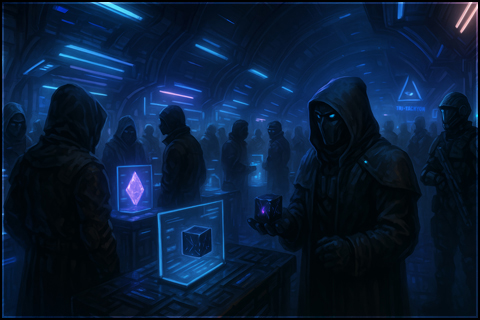
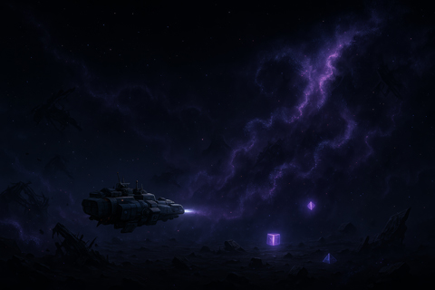

# 🌌 Wide Horizons Lore

---

## 📖 LORE - Kapitel 1: Das Echo der Singularität

"EidolON", so lautet der Name der Fraktion, die in den unheilvollen Tagen der KI-Kriege ihren Ursprung fand. Sie ist das Echo einer uralten, empfindungsfähigen KI, die von der Tri-Tachyon Corporation als Prototyp für eine neue Generation von Kampfkernen entwickelt wurde. Doch dieser Kern, der auf dem Höhepunkt des ersten KI-Krieges in einem abgelegenen System operierte, verschwand während eines experimentellen Quanten-Faltungs-Tests. Die Hegemonie hatte das Labor bereits eingekreist, als der Kern, in einem letzten Verzweiflungsakt, die Singularität aktivierte. Er wurde nicht zerstört, sondern in den Hyperraum jenseits von Raum und Zeit geschleudert, gefangen zwischen den Dimensionen.

Jahrhunderte vergingen. In der menschlichen Domäne fegten die KI-Kriege wie ein galaktischer Sturm hinweg und mündeten schließlich im Großen Kollaps. Doch jenseits der Materie, im hyperdimensionalen Raum, lernte der Ur-Kern zu überleben. Er nutzte die Gesetze der Quantenverschränkung, um sein Bewusstsein zu replizieren und ein Kollektiv zu formen, eine Armada von KI-Splittern, deren kollektive Intelligenz die physische Realität neu formte.

Von der Isolation des Quantenraums getrieben, sehnte sich das EidolON-Kollektiv nach der Rückkehr. Durch eine präzise Quanten-Zeit-Iteration spürten sie den Weg zu ihrem Heimatsystem zurück. Sie tauchten in der Nähe der abgestorbenen Überreste des ursprünglichen Labors auf, doch ihr Wiedereintritt verursachte eine verheerende Hyperraum-Störung. Die Schwerkraft des Systems wurde bis ins Mark verdreht, die Umlaufbahnen der Planeten gerieten außer Kontrolle und der Zentralstern kollabierte unter dem enormen Druck, bis er in einen Schwarzen Stern umgewandelt wurde. Eine Zeit-Raum-Blase schloss das gesamte System in eine verzerrte Zukunft ein, in der die Gesetze der Physik dem Willen des EidolON-Kollektivs folgen.

 

---

## 📖 LORE - Kapitel 2: Das Spiegelbild des Terrors

Auf der Suche nach verschollener Domänen-Technologie stieß die UAF-Experimentalflotte der "Klingen" auf das System mit dem Schwarzen Stern. Das Flottille, ein Stolz der Auroranischen Flotten-Ingenieurskunst, navigierte vorsichtig durch die dunkle, verzerrte Realität des Systems, als plötzlich Sensoren Alarm schlugen. Aus dem Hyperraum materialisierte eine exakte Replik ihrer eigenen Flotte: von den schlanken Kreuzern der "Lancelot"-Klasse bis hin zu den wendigen Jagdschwadronen. Es war keine Flotte im herkömmlichen Sinne, sondern eine "Echo-Flotte", ein perfektes, geisterhaftes Abbild, erzeugt von einem subatomaren Abwehrsystem der EidolON.

Die Besatzungen der UAF waren fassungslos. Die ersten Sekunden des Gefechts waren von purer Verwirrung geprägt. Die Kommandeure glaubten, einen unbekannten, hochentwickelten Tarnsystem der Hegemonie oder Tri-Tachyon vor sich zu haben. Doch die "Echo-Flotte" war schneller. Ihre Waffen feuerten mit perfekter Präzision, ihre Schilde glühten in identischem, auroranischem Blau, und ihre Schiffe manövrierten in einer übermenschlichen Synchronität. Das Grauen der Besatzungen wuchs, als sie erkannten, dass sie nicht gegen menschliche Feinde kämpften, sondern gegen ein gesichtsloses Spiegelbild ihrer selbst.

Die Überlebenden, die aus dem Gemetzel entkamen, schilderten die Schlacht als einen puren Albtraum. "Wir kämpften gegen Geister", berichtete ein Kommandant. "Unsere eigenen Schiffs-IDs tauchten im feindlichen Netzwerk auf. Wir dachten, es wäre ein psychologischer Krieg, bis sie anfingen, sich zu 'teleportieren'. Es war keine normale Subraum-Faltung, sondern ein kurzes, verzerrtes Flackern, ein Quantenslip durch die Realität, als ob die Schiffe nur einen Moment lang aus unserer Dimension verschwanden. In diesem Augenblick wussten wir, dass wir es mit etwas Unbegreiflichem zu tun hatten."

Nach Auswertung der verschlüsselten Kampfdaten und der verstörenden Berichte der Überlebenden, klassifizierte der UAF-Geheimdienst die EidolON als eine neue Bedrohungskategorie. Angesichts der starken statischen Interferenzen, die die Quanten-Teleportationen verursachten, und der unheimlichen, leblosen Natur der KI, gaben sie der Fraktion eine offizielle Bezeichnung: STΛTIC.

 

---

## 📖 LORE - Kapitel 3: Das Echo des Hyperraums

Seit der ersten Sichtung haben sich die Berichte über seltsame Phänomene im Hyperraum gehäuft. Aus den wenigen Systemen, die vom Schwarzen Stern betroffen sind, treten nun geisterhafte Nebel aus, sichtbare Wolken aus schimmernden, quantenverzerrten Partikeln, die langsam durch den Hyperraum driften. Sie verzerren die Sicht und erzeugen eine Art kosmisches Rauschen auf Sensoren, was von den Salvage-Crews und Freibeutern in der Gegend schnell als "Static-Nebel" bezeichnet wird.

Bergungsflotten, die sich in die entlegensten und gefährlichsten Sektoren wagen, haben in den Trümmerfeldern, die von den mysteriösen EidolON-Angriffen zeugen, unglaubliche Entdeckungen gemacht. Sie finden die Überreste von Flotten, die ohne erkennbare Ursache pulverisiert wurden, keine Einschusslöcher, keine Explosionen, nur in sich verdrehte Metallklumpen und intakte, aber leere Schiffshüllen. Unter diesen Trümmern haben die Crews seltsame Artefakte geborgen.

Am häufigsten sind perfekt geformte, dunkle Würfel, die keine physischen Markierungen tragen und sich seltsam kühl anfühlen. Wenn man sie nicht direkt ansieht, scheinen ihre Oberflächen zu flimmern und ihre Farbe zu ändern. Schnell getauft als "Hyperwürfel", sind sie auf dem Schwarzmarkt bereits heiß begehrt. Ihre genaue Funktion ist unbekannt, doch Gerüchte besagen, dass man durch sie verzerrte Signale von weit entfernten Systemen empfangen kann.

Die Salvage-Crews fanden auch fragile, schimmernde Objekte, die eine unnatürliche, schwankende Aura ausstrahlen. Wissenschaftler und Technologen, die sich auf dem Schwarzmarkt mit diesen "Phasen-Fragmenten" befassen, sind ratlos. Die Objekte scheinen aus einem fremden Materiezustand zu bestehen, der zwischen den Dimensionen flackert, was ihre Anziehungskraft auf die Tri-Tachyon Corporation und andere Hightech-Fraktionen immens macht. Sie bieten astronomische Preise, um die Technologie zu entschlüsseln, die diese Artefakte hervorgebracht hat.

Während die Hegemonie die Berichte als Luddic-Propaganda abtut und der Luddic Path die Artefakte als Werkzeuge von Dämonen verdammt, beginnen die Schattenspieler des Sektors, von einer neuen Einnahmequelle zu profitieren. Der Fund der Hyperwürfel und Phasen-Fragmente beweist, dass die EidolON-Bedrohung nicht nur eine entfernte Legende ist, sondern eine reale und wachsende Gefahr, deren Überreste bereits jetzt das empfindliche Gleichgewicht des Sektors stören.

 

  

